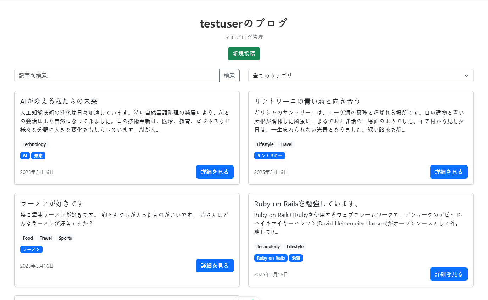
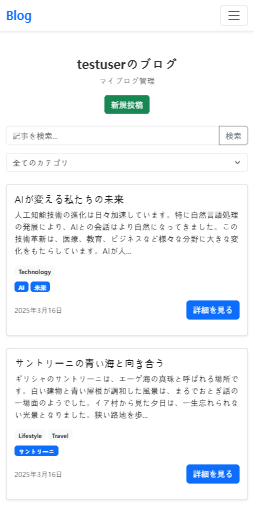
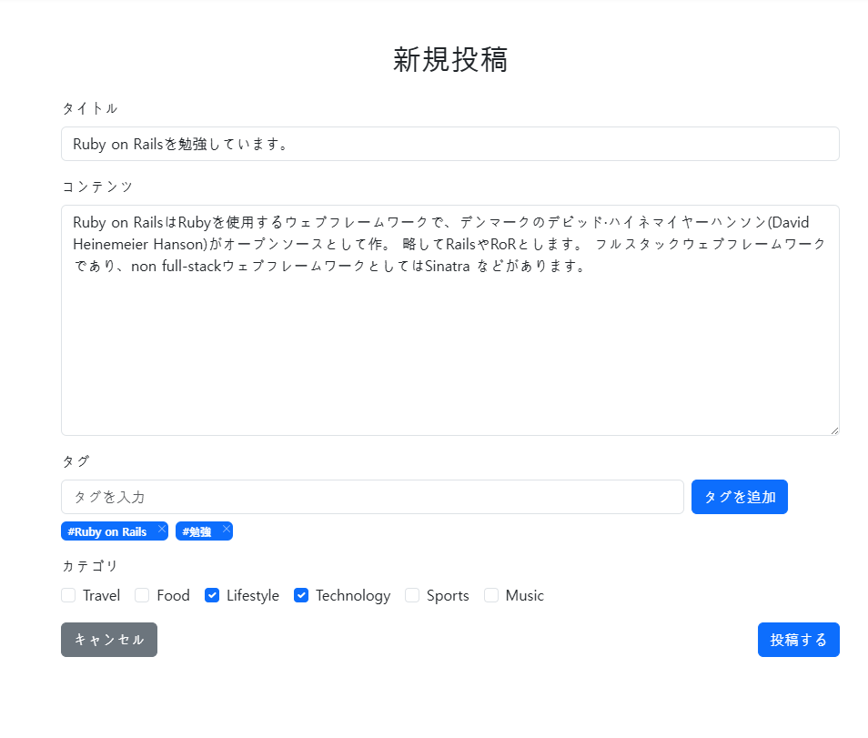
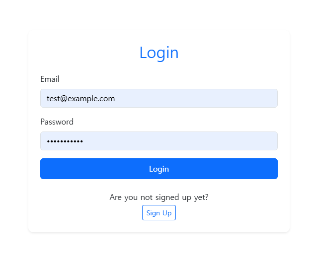

# 💡 blog_platform_rails_vue
Ruby on RailsとVue.jsを使用したシンプルなブログプラットフォームです。

## 🌐 プロジェクトの説明
このプロジェクトはdataXの課題テストとして開発されたブログプラットフォームです。ユーザーは記事の作成、編集、削除ができ、カテゴリーを通じて記事を分類することができます。記事にタグを付けることもできます。

## 💻 技術スタック
- バックエンド: Ruby on Rails
- フロントエンド: Vue.js
- 状態管理: Pinia
- データベース: SQLite
- その他ライブラリ:
   - Axios (HTTPクライアント)
   - Bootstrap (UIフレームワーク)


## ✨ 機能仕様
1. **ブログ記事の管理**
   - 記事の投稿、編集、削除機能
   - カテゴリ選択機能
   - タグの追加、削除機能

2. **検索・フィルタリング機能**
   - Vue.jsを活用ショタカテゴリ別のフィルタリング
   - 記事検索機能の実装

3. **ユーザー認証機能**
   - ログイン・ログアウト機能
   - ユーザー登録機能

4. **レスポンシブデザイン**
   - モバイルデバイス対応
   - bootstrapフレームワークの利用

## 🚀 インストールと実行方法
### 📦 システム要件
- Ruby 3.3.0
- Rails 8.0.1
- Node.js 18.19.1

### 💎 主要ライブラリ（GEM）
- sqlite3 2.6.0
- bcrypt 3.1.20

### 🔧 セットアップ手順
バックエンド設定
```bash
# リポシトリをクローン
git clone https://github.com/mu05041/blog_platform_rails_vue.git
cd backend/mypjt

# バクエンド依存関係をインストール
bundle install

# データベース設定
rails db:create
rails db:migrate
rails db:seed
```

フロントエンド設定
``` bash
# フロントエンド依存関係をインストール
cd frontend/mypjt
npm install
npm install axios
npm i pinia-plugin-persistedstate
npm install bootstrap-vue-3


# セーバー起動
rails s  # バクエンドサーバ
npm run dev  # フロントエンドサーバ
```

##  🧪 テスト
###　テストフレームワーク
- Minitest (Ruby on Railsデフォルトのテストフレームワーク)
### 테스트 실행 방법
```bash
# 全てのテストを実行
rails test

# 特定のコントローラーテストを実行
rails test 
rails test test\controllers\api\v1\posts_controller_test.rb

```

## 🔐 テストアカウント情報

### デフォルトログインアカウント
- メールアドレス: `admin@example.com`
- パスワード: `password123`


## 任意で工夫したポイント
- ERD精度：テーブル間のリレーションを正確に設定。POSTとCATEGOREIS、POSTとTAGの間にM:N関係を構築。
- REST API設計：設計段階で作成したAPI仕様を厳密に遵守。
- フロントエンド状態管理: ログイン/会員登録とカテゴリマッピング情報をPiniaで管理。


## 📸 スクリーンショット

### 메인페이지
- 記事リスト <br>

- モバイルレスポンシブ <br>


### 記事作成画面
- 글 작성 폼 <br>



### 사용자 인증 화면                                 
- ログインページ <br>

- ユーザー登録ページ <br>


## 📑 システムドキュメント
👉[API仕様およびERD](https://capricious-algebra-cf0.notion.site/DataX-1b2aaefa04e680d1a397c4a5243261a7)